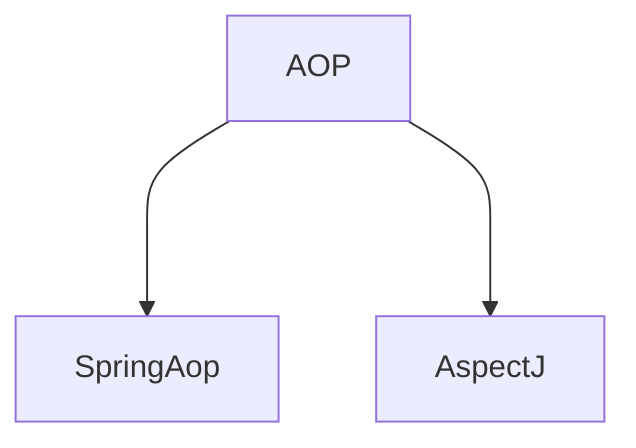
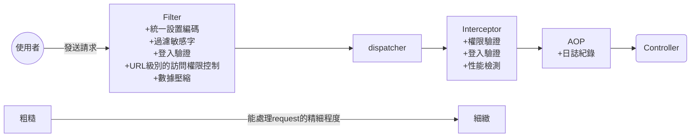
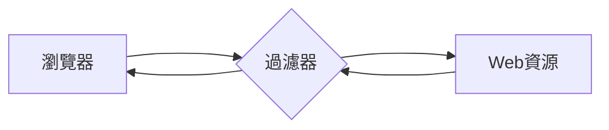
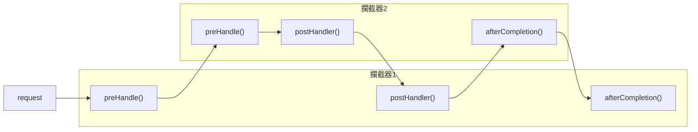
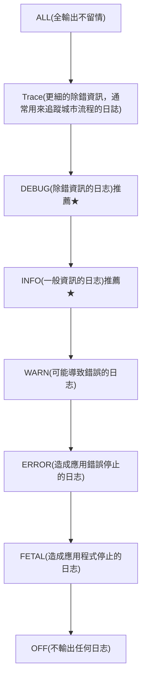
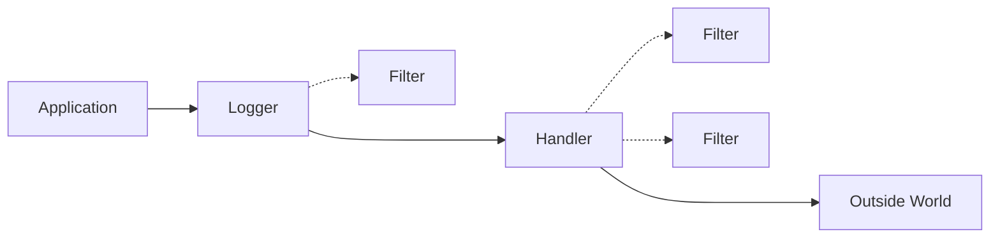

# 目錄

+ [Filter(過濾器)Interceptor(攔截器)AOP(剖面導向程式設計)之差異](#Filter(過濾器)Interceptor(攔截器)AOP(剖面導向程式設計)之差異)
  + [Filter ](#Filter )
  + [Interceptor](#Interceptor)
  + AspectJ

# AspectJ 





## AOP (概念)

面向切面編程，利用AOP可以對業務邏輯的各個部分進行隔離，使得業務邏輯各部分之間的耦合度降低，提高程式的可重用性，同時提高開發的效率

不修改原始碼，從而擴充新功能

# Filter(過濾器)Interceptor(攔截器)AOP(剖面導向程式設計)之差異





## Filter 



在HttpServletRequest到達Servlet之前，過濾、處理一些資訊，本身依賴Sevlet容器，不能獲取SpringBean的一些資訊

#### 自定義Filter

+ 以註解方式製作Filter

```java
/**
* 網路上教學蠻多都是implenments filter，但我建議extend GenericFilterBean
* 會比較方便一點，省去implenments init(), distory()的麻煩 
*/

@Slf4j
@Component
@WebFilter(filterName = "f1",urlPatterns = {"*.html","*.jsp","/"})  //filterName就只是一個名稱可以，隨意就好，urlPattern是用來指定哪些url要經過這個過濾器
public class HiFilter extends GenericFilterBean {
    
    @Override
    public void doFilter(ServletRequest request, ServletResponse response, FilterChain chain) throws IOException, ServletException {
      log.info("Hello Hoxton");
      chain.doFilter(request,response);
    }
}
```


結果如上


+ 以Java配置方式製作Filter

```java
@Slf4j
/**
* 網路上教學蠻多都是implenments filter，但我建議extend GenericFilterBean
* 會比較方便一點，省去implenments init(), distory()的麻煩 
*/

public class HiFilter extends GenericFilterBean {

    @Override
    public void doFilter(ServletRequest request, ServletResponse response, FilterChain chain) throws IOException, ServletException {
      log.info("Hello Hoxton");
      chain.doFilter(request,response);
    }
}
```

```java
@Configuration
public class FilterConfig {
    @Bean
    public FilterRegistrationBean heFilterRegistration() {
        FilterRegistrationBean registration = new FilterRegistrationBean(new HiFilter());
        registration.addUrlPatterns("/*"); //配置相關的路徑
        return registration;
    }
}
```

> 一些其他的config設置，僅供參考，與上面事例無關
>
> ```java
> @Configuration
> public class FilterConfig {
>     //test
>     @Bean
>     public FilterRegistrationBean<Filter> logProcessTimeFilter() {
>         FilterRegistrationBean<Filter> bean = new FilterRegistrationBean<>();
>         bean.setFilter(new LogProcessTimeFilter()); //設定想要使用哪一個Filter
>         bean.addUrlPatterns("/*"); //設置哪些url會觸發Filter，設置成/* 就代表全部都會吃到，/user/*就代表/user開頭的都會吃到
>         bean.setName("logProcessTimeFilter"); //設置要叫什麼名字
>         bean.setOrder(0); //設定過濾器的執行順序
>         return bean;
>     }
> 
>     @Bean
>     public FilterRegistrationBean<Filter> logApiFilter() {
>         FilterRegistrationBean<Filter> bean = new FilterRegistrationBean<>();
>         bean.setFilter(new LogApiFilter()); //設定想要使用哪一個Filter
>         bean.addUrlPatterns("/*"); //設置哪些url會觸發Filter，設置成/* 就代表全部都會吃到，/user/*就代表/user開頭的都會吃到
>         bean.setName("logApiFilter"); //設置要叫什麼名字
>         bean.setOrder(1); //設定過濾器的執行順序
>         return bean;
>     }
>     @Bean
>     public FilterRegistrationBean<Filter> printResponseRequestFilter() {
>         FilterRegistrationBean<Filter> bean = new FilterRegistrationBean<>();
>         bean.setFilter(new PrintResponseRequest()); //設定想要使用哪一個Filter
>         bean.addUrlPatterns("/*"); //設置哪些url會觸發Filter，設置成/* 就代表全部都會吃到，/user/*就代表/user開頭的都會吃到
>         bean.setName("printResponseRequestFilter"); //設置要叫什麼名字
>         bean.setOrder(2); //設定過濾器的執行順序
>         return bean;
>     }
> 
> }
> ```
>
> 


SpringBoot本身也提供了許多不同的Filter供使用，參考如下


其中以**OncePerRequestFilter**最常被使用，這個Filter會去**過濾每一個Request請求，且不會重複執行**，且這個Filter有一個doFilterInternal()的方法，供我們撰寫Filter邏輯`因doFilter()的方法已在OncePerRequestFilter裡面實現了`，可以用來做Jwtoken的登入驗證，程式如下：


```java
@Component
public class JwtAuthenticationFilter extends OncePerRequestFilter {

    @Autowired
    private JwtService jwtService;

    @Autowired
    private UserDetailsService userDetailsService;

    //注入JwtService UserDetailsService，分別用來解析Token與查詢使用者詳情


    @Override
    protected void doFilterInternal(HttpServletRequest request, HttpServletResponse response, FilterChain filterChain) throws          ServletException, IOException {
        String authHeader = request.getHeader(HttpHeaders.AUTHORIZATION);
        if (authHeader != null) {
            String accessToken = authHeader.replace("Bearer ", "");
            //從請求標頭中取得Authorization欄位中的值
            Map<String, Object> claims = jwtService.parseToken(accessToken);
            //擷取出後面的JWT字串，接著解析它
            String username = (String) claims.get("username");
            //從claims物件中取得username欄位的值
            UserDetails userDetails = userDetailsService.loadUserByUsername(username);
            //並透過userDetailService查詢使用者詳情。這也代表JWT的內容(payload)必須包含username這個欄位
            //在filter中查詢使用者的目的，是為了將該次請求所代表的驗證後資料(Authentication)帶進security中的Context。
            //Context是一種較抽象的概念，可以想像成該次請求的身分狀態

            Authentication authentication = new UsernamePasswordAuthenticationToken(userDetails, null, userDetails.getAuthorities());
            //為了將這個請求的使用者身分告訴伺服器，我們建立UsernamePasswordAuthenticationToken的物件，其中第三個參數放GrantedAuthority的List，              作為API的授權檢查
            //第一個參數(principal)傳入使用者詳請(UserDetails)。
            // 而第二個參數是credential，通常是密碼，但不傳入也無訪
            //經由傳入principal，我們得以在業務邏輯中從Context輕易獲取使用者身分的資料
            SecurityContextHolder.getContext().setAuthentication(authentication);
        }
        filterChain.doFilter(request, response);


    }
}
```


配置完後再將這個Filter加入Security的過濾鍊


```java
@EnableWebSecurity
public class SecurityConfig extends WebSecurityConfigurerAdapter {

    @Autowired
    private   UserDetailsService userDetailsService;

    @Autowired
    private JwtAuthenticationFilter jwtAuthenticationFilter;

    /**
     * 協助帳號密碼認證的東西
     * @return
     */
    @Override
    @Bean
    public AuthenticationManager authenticationManagerBean() throws Exception {
            return super.authenticationManagerBean();

    }
    //加入Security的過濾鍊
    protected void configure(HttpSecurity http) throws Exception {
        http.authorizeHttpRequests()
                .antMatchers(HttpMethod.GET, "/users/**").hasAuthority(MemberAuthority.SYSTEM_ADMIN.name())
//                .antMatchers(HttpMethod.GET,"/h2/**").hasAuthority(MemberAuthority.SYSTEM_ADMIN.name())
                .antMatchers(HttpMethod.GET,"/login/**").permitAll()
//                .antMatchers(HttpMethod.POST,"login").permitAll()
//                .antMatchers(HttpMethod.POST, "/users").permitAll()
                .anyRequest().permitAll()
                .and()
                .addFilterBefore(jwtAuthenticationFilter, UsernamePasswordAuthenticationFilter.class) //於UsernamePasswordAuthenticationFilter進行認證
                .sessionManagement()
                .sessionCreationPolicy(SessionCreationPolicy.STATELESS)
                .and()
                .csrf().disable()
                .formLogin();
        http.headers().frameOptions().disable();
        //讓spring Security可以和h2建立連線
    }

    /**
     *
     * @param auth 配置全局驗證資訊，如Authentication Provider,UserDetailService等等資訊，
     *             authenticationManager會接收到UsernamePasswordAuthenticationToken傳入的資料後
     *             調用SecurityConfig中所配置的userDetailsService,passwordEncoder來協助驗證
     *
     * @throws Exception
     */
    protected void configure(AuthenticationManagerBuilder auth) throws Exception {
        auth.userDetailsService(userDetailsService).passwordEncoder(new BCryptPasswordEncoder());
    }
}
```


一些Code的示範

```java
public class LogProcessTimeFilter extends OncePerRequestFilter {
    /**
     * @param request     請求
     * @param response    回應
     * @param filterChain 過濾鏈 會將現有的filter給串聯起來，當請求進入後端，需要依序經過它們才會達到Controller，相對的，當回應離開Controller，則是按照相反的方向經過那些Filter
     * @throws ServletException
     * @throws IOException
     */
    @Override
    protected void doFilterInternal(HttpServletRequest request, HttpServletResponse response, FilterChain filterChain) throws ServletException, IOException {
        long startTime = System.currentTimeMillis();
        filterChain.doFilter(request, response); //doFilter:相當於將請求送至Controller。
        long endTime = System.currentTimeMillis();
        long processTime = endTime - startTime;
        System.out.println("processTime = " + processTime);
    }
}
```

```java
/**
 * Controller收到的請求主體(RequestBody)和回應主體(ResponseBody)
 * 分別由HttpServletRequest與HttpServletResponse的InputStream、OutputStream轉化而來，
 * 但資料流只能讀取一次，如果在Filter層就被讀掉，可能會導致後面都收不到資料
 * 為了保留主體中的資料，我們將請求主體與回應主體包裝成ContentCachingResponseWrapper ContentCachingRequestWrapper
 * 再如同往常傳入FilterChain
 *
 * 這兩個Wrapper的特色是會在內部備份一個ByteArrayOutputStream，我們只要呼叫這兩個Wrapper的
 * getContentAsByteArray就可以無限制地取得主體內容
 */
public class PrintResponseRequest extends OncePerRequestFilter {
    @Override
    protected void doFilterInternal(HttpServletRequest request, HttpServletResponse response, FilterChain filterChain) throws ServletException, IOException {
        ContentCachingRequestWrapper requestWrapper = new ContentCachingRequestWrapper(request);
        ContentCachingResponseWrapper responseWrapper = new ContentCachingResponseWrapper(response);
        filterChain.doFilter(requestWrapper, responseWrapper);
//        logApi(request, response);
        logBody(requestWrapper,responseWrapper);

        responseWrapper.copyBodyToResponse();
    }


    private void logApi(HttpServletRequest request, HttpServletResponse response) throws ServletException, IOException {
        int httpStatus = response.getStatus(); //200,403,404之類的
        String httpMethod = request.getMethod();
        String uri = request.getRequestURI();
        String params = request.getQueryString();
        if (params != null) {
            uri += "?" + params;
        }
        System.out.println(String.join(" ", String.valueOf(httpStatus), httpMethod, uri));
    }
    private void logBody(ContentCachingRequestWrapper request, ContentCachingResponseWrapper response) {
        String requestBody = getContent(request.getContentAsByteArray());
        System.out.println("Request: " + requestBody);

        String responseBody = getContent(response.getContentAsByteArray());
        System.out.println("Response: " + responseBody);
    }

    /**
     * @param content
     * @return 返回JSON字串
     */
    private String getContent(byte [] content){
        String body = new String(content);
        return body.replaceAll("[\n\t]", ""); //去除換行\n與定位符號\t
    }


}
```


## Interceptor

本身是AOP的一種應用，其實攔截器跟過濾器是可以互相替換的，功能其實差不多，只是**攔截器可以在請求到達Controller或是回應回傳出Contrller時進行攔截**，攔截成功時可以實做一些自定義的業務邏輯進行修改





### AOP


# AOP 底層原理

1. 動態代理(Spring5本身已經封裝了)

   1. 有兩種情況的動態代理

      1. 有介面(JDK動態代理)

         

         ```java
         interface UserDao{
             public void login();
         }
         ```

         ```java
         class UserDaoImpl implements　UserDao{
             public void login(){  
             }
         }
         ```

         1. 創建UserDao介面實現類的代理對象，代理對象會有被代理對象的所有方法，並且增強

         

      2. 無介面(CGLIB動態代理)

         ```java
         class User{
          public void add (){
              
          }   
         }
         ```

         ```java
         class Person extends User{
             public void add(){
                 super.add();
             }
         }
         ```

         1. CGLIB(Code Generation Library)動態代理
            1. 創建當前類子類的代理對象

      

      ## AOP(JDK動態代理)

      1. 使用JDK的動態代理，要使用Proxy類裡面的方法來創建出代理對象 `newProxyInstance(類加載器,增強方法所在的類，這個類實現的介面,實現這個接口(InvocationHandler)`

         

      2. 編寫JDK動態代碼

         

         ```java
         public interface UserDao {
             public int add (int a,int b);
         
             public String update(String id);
         }
         
         ```

         ```java
         public class UserDaoImpl implements UserDao{
             @Override
             public int add(int a, int b) {
                 System.out.println("add方法執行了");
                 return a+b;
             }
         
             @Override
             public String update(String id) {
                 return id;
             }
         }
         
         ```

         ```java
         package com.example.aop;
         
         import java.lang.reflect.InvocationHandler;
         import java.lang.reflect.Method;
         import java.lang.reflect.Proxy;
         import java.util.Arrays;
         
         /**
          * @author Hoxton
          * @version 1.1.0
          */
         public class JDKProxy {
         
             public static void main(String[] args) {
                 Class[] interfaces = {UserDao.class};
                 UserDaoImpl userDao = new UserDaoImpl();
                 UserDao dao = (UserDao) Proxy.newProxyInstance(JDKProxy.class.getClassLoader(), interfaces, new UserDaoProxy(userDao));
                 //此dao已經不是原本的dao，而是新的代理類dao了
                 int result = dao.add(1, 2);
                 System.out.println("result = " + result);
             }
         }
         //創建代理對象的代碼
         class UserDaoProxy implements InvocationHandler {
         
             //1. 把創建的是誰的代理對象，把誰傳遞進來
             // 有參建構子
             private Object obj;
         
             public UserDaoProxy(Object obj) {
                 this.obj = obj;
             }
         
         
             //增強的邏輯
             @Override
             public Object invoke(Object proxy, Method method, Object[] methodArgs) throws Throwable {
         
                 //方法之前
                 System.out.println("方法之前執行..." + method.getName() + "傳遞的參數..." + Arrays.toString(methodArgs));
                 //被增強的方法執行
                 Object res = method.invoke(obj, methodArgs);
                 //方法之後
                 System.out.println("方法之後執行..." + obj);
         
                 return res;
             }
         }
         ```

         

# AOP專業術語

1. 連接點

   一個類裡面中，能被增強的方法就叫連接點，下面這個類就有四個連接點

   

   ```java
   class User{
       add();
       update();
       select();
       delete();
   }
   ```

2. 切入點

   實際被增強的方法，就叫切入點

3. 通知(增強)

   1. 實際增強的邏輯部分稱為通知(增強)

   2. 通知有多種類型

      1. 前置通知

         在切入點前執行

      2. 後置通知

         在切入點後執行

      3. 環繞通知

         在切入點前後執行

      4. 異常通知

         出現異常時執行

      5. 最終通知

         執行到try...catch的final時執行

4. 切面

   是一個動作

   1. 把通知應用到切入點的過程，就叫切面


# AOP(準備)

1. Spring 框架一般都是基於AspectJ實現的AOP操作

   1. 什麼是AspectJ

      + AspectJ不是Spring的組成部分，是一個獨立的AOP框架， 一般把AspectJ和Spring框架一起使用，進行AOP操作

   2. 基於Aspect實現AOP操作

      1. xml配置文件實現
      2. 基於註解方法實現(主要使用)

   3. 再專案裡面引入AOP依賴

   4. 切入點表達式

      1. 切入點表達式的作用: 知道對哪個類的哪個方法進行增強

      2. 語法結構:

         execution( [權限修飾符] [返回類型] [類全路徑] [方法名稱] ( [參數列表] ) )
         
         + 權限修飾符: public, private, *(代表不論是public, private 都選)
         
         + 返回類型: String, int
         
         + 類全路徑: com.hoxton.......
         
         + 方法名稱: 就方法名稱
         
         + 參數列表: 有哪些參數
         
           舉例
         
           1. 對com.hoxton.dao.BookDao類裡面的add方法進行增強
         
              + ```java
                execution(* com.hoxton.dao.BookDao.add(..) )
                ```
         
           2. 對com.hoxton.dao.BookDao類的所有方法進行增強
         
              + ```java
                execution(* com.hoxton.dao.BookDao.*(..))
                ```
         
           3. 對com.hoxton.dao包裡的所有類，類裡面的髓有方法進行增強
         
              + ```java
                excution(* com.hoxton.dao.*.*(..))
                ```
         
         
         within([package名].* )或( [package名]..*)
         
         ​	舉例
         
         	1. 
         	1. 
         
         
   
   

# AOP操作(Aspect J  註解)

1. 創建類，在類裡面定義方法

```java
public class User {

    public void add(){
        System.out.println("add");
    }
}
```

2. 創建增強類(編寫增強邏輯)

   1. 在增強類的裡面，創建方法，讓不同方法代表不同通知類型

      ```java
      public class UserProxy {
          public void before(){
              System.out.println("before");
          }
      }
      ```

3. 進行通知的配置

   1. 在Spring


# Log4j 2




## JUL 入門




# 參考


https://www.cnblogs.com/itlihao/p/14329905.html

https://blog.csdn.net/fly910905/article/details/86537648

https://codertw.com/%E7%A8%8B%E5%BC%8F%E8%AA%9E%E8%A8%80/712557/


# 


>>>>>>> 
