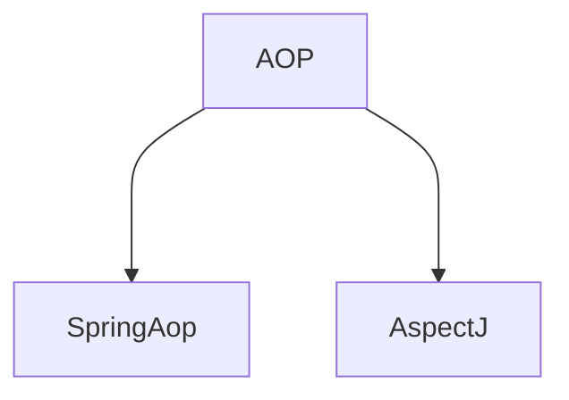

# AspectJ 





## AOP (概念)

面向切面編程，利用AOP可以對業務邏輯的各個部分進行隔離，使得業務邏輯各部分之間的耦合度降低，提高程式的可重用性，同時提高開發的效率

不修改原始碼，從而擴充新功能

# AOP 底層原理

1. 動態代理(Spring5本身已經封裝了)

   1. 有兩種情況的動態代理

      1. 有介面(JDK動態代理)

         

         ```java
         interface UserDao{
             public void login();
         }
         ```

         ```java
         class UserDaoImpl implements　UserDao{
             public void login(){  
             }
         }
         ```

         1. 創建UserDao介面實現類的代理對象，代理對象會有被代理對象的所有方法，並且增強

         

      2. 無介面(CGLIB動態代理)

         ```java
         class User{
          public void add (){
              
          }   
         }
         ```

         ```java
         class Person extends User{
             public void add(){
                 super.add();
             }
         }
         ```

         1. CGLIB(Code Generation Library)動態代理
            1. 創建當前類子類的代理對象

      

      ## AOP(JDK動態代理)

      1. 使用JDK的動態代理，要使用Proxy類裡面的方法來創建出代理對象 `newProxyInstance(類加載器,增強方法所在的類，這個類實現的介面,實現這個接口(InvocationHandler)`

         

      2. 編寫JDK動態代碼

         

         ```java
         public interface UserDao {
             public int add (int a,int b);
         
             public String update(String id);
         }
         
         ```

         ```java
         public class UserDaoImpl implements UserDao{
             @Override
             public int add(int a, int b) {
                 System.out.println("add方法執行了");
                 return a+b;
             }
         
             @Override
             public String update(String id) {
                 return id;
             }
         }
         
         ```

         ```java
         package com.example.aop;
         
         import java.lang.reflect.InvocationHandler;
         import java.lang.reflect.Method;
         import java.lang.reflect.Proxy;
         import java.util.Arrays;
         
         /**
          * @author Hoxton
          * @version 1.1.0
          */
         public class JDKProxy {
         
             public static void main(String[] args) {
                 Class[] interfaces = {UserDao.class};
                 UserDaoImpl userDao = new UserDaoImpl();
                 UserDao dao = (UserDao) Proxy.newProxyInstance(JDKProxy.class.getClassLoader(), interfaces, new UserDaoProxy(userDao));
                 //此dao已經不是原本的dao，而是新的代理類dao了
                 int result = dao.add(1, 2);
                 System.out.println("result = " + result);
             }
         }
         //創建代理對象的代碼
         class UserDaoProxy implements InvocationHandler {
         
             //1. 把創建的是誰的代理對象，把誰傳遞進來
             // 有參建構子
             private Object obj;
         
             public UserDaoProxy(Object obj) {
                 this.obj = obj;
             }
         
         
             //增強的邏輯
             @Override
             public Object invoke(Object proxy, Method method, Object[] methodArgs) throws Throwable {
         
                 //方法之前
                 System.out.println("方法之前執行..." + method.getName() + "傳遞的參數..." + Arrays.toString(methodArgs));
                 //被增強的方法執行
                 Object res = method.invoke(obj, methodArgs);
                 //方法之後
                 System.out.println("方法之後執行..." + obj);
         
                 return res;
             }
         }
         ```

         

# AOP專業術語

1. 連接點

   一個類裡面中，能被增強的方法就叫連接點，下面這個類就有四個連接點

   ```java
   class User{
       add();
       update();
       select();
       delete();
   }
   ```

2. 切入點

   實際被增強的方法，就叫切入點

3. 通知(增強)

   1. 實際增強的邏輯部分稱為通知(增強)

   2. 通知有多種類型

      1. 前置通知

         在切入點前執行

      2. 後置通知

         在切入點後執行

      3. 環繞通知

         在切入點前後執行

      4. 異常通知

         出現異常時執行

      5. 最終通知

         執行到try...catch的final時執行

4. 切面

   是一個動作

   1. 把通知應用到切入點的過程，就叫切面


# AOP(準備)

1. Spring 框架一般都是基於AspectJ實現的AOP操作

   1. 什麼是AspectJ

      + AspectJ不是Spring的組成部分，是一個獨立的AOP框架， 一般把AspectJ和Spring框架一起使用，進行AOP操作

   2. 基於Aspect實現AOP操作

      1. xml配置文件實現
      2. 基於註解方法實現(主要使用)

   3. 再專案裡面引入AOP依賴

   4. 切入點表達式

      1. 切入點表達式的作用: 知道對哪個類的哪個方法進行增強

      2. 語法結構:

         execution( [權限修飾符] [返回類型] [類全路徑] [方法名稱] ( [參數列表] ) )
         
         + 權限修飾符: public, private, *(代表不論是public, private 都選)
         
         + 返回類型: String, int
         
         + 類全路徑: com.hoxton.......
         
         + 方法名稱: 就方法名稱
         
         + 參數列表: 有哪些參數
         
           舉例
         
           1. 對com.hoxton.dao.BookDao類裡面的add方法進行增強
         
              + ```java
                execution(* com.hoxton.dao.BookDao.add(..) )
                ```
         
           2. 對com.hoxton.dao.BookDao類的所有方法進行增強
         
              + ```java
                execution(* com.hoxton.dao.BookDao.*(..))
                ```
         
           3. 對com.hoxton.dao包裡的所有類，類裡面的髓有方法進行增強
         
              + ```java
                excution(* com.hoxton.dao.*.*(..))
                ```
         
              
   
   


# 


>>>>>>> 
